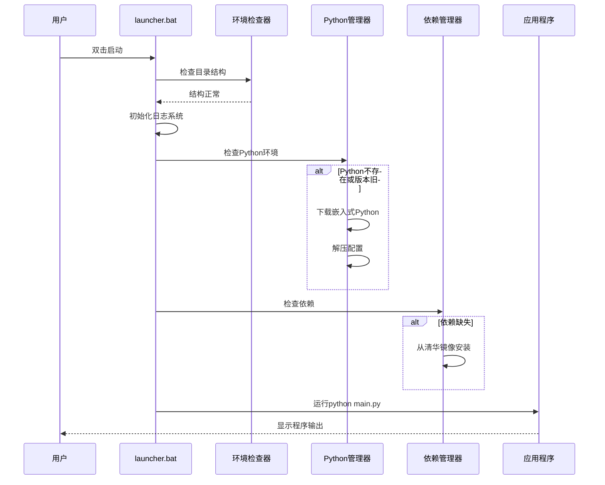

# 材料匹配工具启动器设计规范

## 元数据
- **设计日期**: 2026-03-21
- **项目名称**: material-matcher (Excel材料价格匹配CLI工具)
- **设计主题**: Windows批处理启动器，用于非技术用户便捷部署
- **设计者**: Claude Haiku 4.5
- **用户需求**: 为完全不懂计算机的用户打包Python命令行工具，支持无git环境下的代码更新和依赖管理

## 1. 背景与目标

### 1.1 项目背景
material-matcher是一个Python命令行工具，用于匹配两个Excel文件中的材料规格并整合价格数据。当前通过uv或uvx部署，但需要更简单的部署方式给非技术用户使用。

### 1.2 设计目标
1. **零技术门槛**: 用户只需双击bat文件即可使用
2. **无环境依赖**: 无需安装Python、git等开发工具
3. **国内网络友好**: 使用国内镜像源下载依赖
4. **离线支持**: 首次安装后可在无网络环境下运行
5. **更新可控**: 手动更新代码，避免自动更新带来的意外

### 1.3 用户场景
- **用户**: 建筑/工程行业非技术人员，可能对命令行不熟悉
- **使用频率**: 每周几次，处理Excel材料报价表
- **计算机环境**: Windows 10/11，可能有杀毒软件，网络条件一般

## 2. 需求规格

### 2.1 功能需求
| 需求ID | 需求描述 | 优先级 |
|--------|----------|--------|
| FR-01 | 双击bat文件启动程序 | 必需 |
| FR-02 | 自动管理嵌入式Python环境 | 必需 |
| FR-03 | 从gitee下载最新代码（无需git） | 必需 |
| FR-04 | 使用国内镜像安装Python依赖 | 必需 |
| FR-05 | 处理Python进程占用问题 | 必需 |
| FR-06 | 提供手动更新脚本 | 必需 |
| FR-07 | 离线运行支持 | 必需 |
| FR-08 | 友好的命令行界面（彩色输出） | 推荐 |
| FR-09 | 详细的日志记录 | 推荐 |
| FR-10 | 错误恢复机制 | 推荐 |

### 2.2 非功能需求
- **性能**: 启动时间不超过30秒（缓存已建立后）
- **兼容性**: Windows 7/10/11，x64架构
- **网络**: 支持国内网络环境，使用清华镜像源
- **安全性**: 不要求管理员权限，不修改系统环境变量
- **体积**: 嵌入式Python + 代码 < 50MB

## 3. 系统架构

### 3.1 目录结构
```
material-matcher-launcher/          # 用户解压后的根目录
├── launcher.bat                    # 主启动脚本（用户双击这个）
├── update.bat                      # 独立更新脚本
├── python/                         # 嵌入式Python环境
│   ├── python.exe
│   ├── Scripts/pip.exe
│   ├── python3x._pth              # 嵌入式Python配置文件
│   └── ...
├── app/                            # 应用程序代码
│   ├── main.py
│   ├── material_matcher/          # 核心业务代码
│   ├── pyproject.toml             # 项目配置和依赖
│   └── ...
├── cache/                          # 缓存目录
│   ├── dependencies/               # pip包缓存
│   ├── downloads/                  # 临时下载文件
│   └── python/                     # 缓存的Python安装包
├── logs/                           # 日志文件
│   └── launcher_%DATE%.log
└── config/                         # 配置文件
    └── mirror_sources.txt          # 镜像源配置
```

### 3.2 组件架构
```
┌─────────────────────────────────────────────────────────────┐
│                    用户交互层                                 │
│  • launcher.bat (彩色命令行界面)                             │
│  • update.bat (更新专用脚本)                                 │
└───────────────────────────────┬─────────────────────────────┘
                                │
┌───────────────────────────────▼─────────────────────────────┐
│                    核心管理层                                 │
│  • 环境管理器 (PythonEnvironment)                           │
│  • 代码更新器 (CodeUpdater)                                 │
│  • 依赖管理器 (DependencyManager)                           │
│  • 进程管理器 (ProcessManager)                              │
└───────────────────────────────┬─────────────────────────────┘
                                │
┌───────────────────────────────▼─────────────────────────────┐
│                    基础设施层                                 │
│  • 网络下载器 (使用PowerShell/BITS)                         │
│  • 文件操作器 (xcopy, PowerShell)                           │
│  • 日志记录器 (追加到文件和控制台)                           │
└─────────────────────────────────────────────────────────────┘
```

## 4. 详细设计

### 4.1 主启动脚本 (launcher.bat)

#### 4.1.1 启动流程


#### 4.1.2 关键功能
- **彩色输出**: 使用ANSI转义序列提供绿色(✓)/黄色(⚠)/红色(✗)状态指示
- **进度显示**: 每个步骤显示`[步骤/总数] 描述...`
- **错误处理**: 捕获关键错误，提供恢复选项
- **日志记录**: 所有操作记录到`logs/launcher_%DATE%.log`

#### 4.1.3 命令行参数
```batch
launcher.bat [选项]
选项：
  --help       显示帮助信息
  --update     检查并更新代码，然后退出（不运行程序）
  --force      强制模式（覆盖文件，终止占用进程）
  --offline    离线模式（禁用网络检查，使用缓存）
  --clean      清理缓存和临时文件
  --verbose    详细日志输出
```

#### 4.1.4 兼容性处理
**ANSI颜色兼容性**：
- **Windows 10+**：原生支持ANSI转义序列
- **Windows 7/8**：需要启用`ENABLE_VIRTUAL_TERMINAL_PROCESSING`
- **兼容性检测**：
  ```batch
  :: 检测Windows版本
  ver | findstr /i "10." >nul
  if %errorlevel% == 0 (
      set SUPPORTS_ANSI=true
  ) else (
      :: 老版本Windows使用无颜色输出
      set SUPPORTS_ANSI=false
  )
  ```

**路径空格处理**：
- **问题**：用户可能解压到`C:\Program Files\`等含空格路径
- **解决方案**：始终使用引号包裹路径
  ```batch
  :: 正确做法
  set "APP_DIR=%~dp0app"
  python.exe "%APP_DIR%\main.py"

  :: 错误做法
  python.exe %~dp0app\main.py  # 路径含空格时会失败
  ```

**更新机制澄清**：
- `launcher.bat --update`：仅更新代码，不运行程序（适合熟练用户）
- `update.bat`：独立更新脚本，提供完整更新流程（适合普通用户）
- **分工原则**：`update.bat`提供更友好的用户界面和错误处理，`--update`参数供脚本集成使用

**日志轮转实现**：
```batch
:: 清理7天前的日志文件
forfiles /p "logs" /m "launcher_*.log" /d -7 /c "cmd /c del @file"
if exist "logs\launcher_%DATE%.log" (
    :: 如果文件过大（>10MB），压缩归档
    for %%F in ("logs\launcher_%DATE%.log") do (
        if %%~zF GTR 10485760 (
            powershell Compress-Archive -Path "logs\launcher_%DATE%.log" -DestinationPath "logs\archive_%DATE%.zip"
            del "logs\launcher_%DATE%.log"
        )
    )
)
```

### 4.2 Python环境管理器

#### 4.2.1 嵌入式Python下载
- **源**: Python官方嵌入式版本 (`python-3.12.x-embed-amd64.zip`)
- **备用源**: 国内镜像如淘宝镜像
- **版本检查**: 比较本地版本与最新可用版本
- **下载策略**: 断点续传，校验SHA256

#### 4.2.2 配置修改
嵌入式Python需要修改`python3x._pth`文件以启用pip和site-packages：
```
python312.zip
.
import site  # 取消注释此行以启用site-packages
```

#### 4.2.3 嵌入式Python pip安装
嵌入式Python默认不包含pip，需要额外安装：

1. **下载get-pip.py**：
   ```batch
   powershell -Command "Invoke-WebRequest -Uri 'https://bootstrap.pypa.io/get-pip.py' -OutFile 'cache\get-pip.py'"
   ```

2. **安装pip**：
   ```batch
   python.exe cache\get-pip.py --no-warn-script-location
   ```

3. **验证安装**：
   ```batch
   python.exe -m pip --version
   ```

4. **配置备用方案**：如果网络失败，使用预下载的`get-pip.py`副本或从国内镜像下载：
   ```
   https://mirrors.tuna.tsinghua.edu.cn/pypi/web/simple/pip/
   ```

#### 4.2.4 网络下载备选方案
针对不同Windows环境的下载工具兼容性：

| 工具 | 检测方法 | 使用场景 |
|------|----------|----------|
| **PowerShell** | `if exist "%SystemRoot%\System32\WindowsPowerShell\v1.0\powershell.exe"` | Windows 7+，默认首选 |
| **BITSAdmin** | `if exist "%SystemRoot%\System32\bitsadmin.exe"` | 老版本Windows，企业环境限制PS |
| **certutil** | `if exist "%SystemRoot%\System32\certutil.exe"` | 最后备选方案 |
| **手动下载** | 无可用工具时 | 提供手动下载链接和说明 |

**PowerShell执行策略问题**：
- **问题**：企业环境可能限制`Restricted`执行策略
- **解决方案**：
  ```batch
  :: 临时绕过执行策略（不修改系统设置）
  powershell -ExecutionPolicy Bypass -Command "下载命令"
  :: 或使用编码命令
  powershell -EncodedCommand "编码的Base64命令"
  ```

### 4.3 代码更新器 (update.bat)

#### 4.3.1 更新流程
1. **版本检查**: 下载gitee上的`version.txt`，与本地比较MD5
2. **代码下载**: 使用PowerShell下载仓库zip包
   ```powershell
   Invoke-WebRequest -Uri "https://gitee.com/用户名/material-matcher/repository/archive/master.zip" -OutFile "cache/update.zip"
   ```
3. **备份恢复**: 备份当前`app/`目录，支持更新失败回滚
4. **文件替换**: 解压zip包，覆盖`app/`目录
5. **清理**: 删除临时文件，更新版本记录

#### 4.3.2 版本检查机制
1. **远程版本文件**: `https://gitee.com/用户名/material-matcher/raw/master/version.txt`
   ```
   2026-03-21
   commit_hash: abc123def456
   file_hash: md5:xxxxxxxxxxxx
   ```
2. **本地版本文件**: `app/version.txt`
3. **比较策略**: 优先比较commit_hash，其次文件MD5

#### 4.3.3 版本文件管理
**version.txt文件格式**：
```ini
# 材料匹配工具版本信息
version_date = 2026-03-21
commit_hash = abc123def4567890abc123def4567890abcdef12
file_hash = md5:d41d8cd98f00b204e9800998ecf8427e
build_number = 42
dependencies_hash = sha256:abc123...

# 更新日志（最后3次更新）
[changelog]
2026-03-21 = 修复匹配算法性能问题
2026-03-20 = 添加新的Excel模板支持
2026-03-18 = 初始版本发布
```

**生成方法**：
1. **开发阶段**：在gitee仓库根目录创建`version.txt`
2. **自动化生成**（推荐）：
   ```bash
   # 生成version.txt的脚本示例
   echo "# 材料匹配工具版本信息" > version.txt
   echo "version_date = $(date +%Y-%m-%d)" >> version.txt
   echo "commit_hash = $(git rev-parse HEAD)" >> version.txt
   echo "file_hash = md5:$(find . -type f -name '*.py' | sort | xargs md5sum | md5sum | cut -d' ' -f1)" >> version.txt
   ```

**文件完整性验证**：
- **MD5校验**：比较关键文件的MD5值
- **SHA256校验**：下载大文件时验证完整性
- **文件大小检查**：确保文件完整下载
- **实现示例**：
  ```batch
  :: 验证下载文件的SHA256
  certutil -hashfile cache\update.zip SHA256 | find /i "正确哈希值"
  if errorlevel 1 (
      echo 文件校验失败，可能下载损坏
      del cache\update.zip
  )
  ```

### 4.4 依赖管理器

#### 4.4.1 依赖解析
- **源文件**: `app/pyproject.toml` 或 `app/requirements.txt`
- **依赖锁定**: 生成`cache/dependencies.lock`记录已安装版本
- **冲突解决**: 检测版本冲突，提供降级或跳过选项

#### 4.4.2 安装流程
```batch
:: 使用清华镜像源
python -m pip install --upgrade pip
python -m pip install -r requirements.txt ^
    -i https://pypi.tuna.tsinghua.edu.cn/simple ^
    --trusted-host pypi.tuna.tsinghua.edu.cn ^
    --cache-dir "cache\dependencies"
```

#### 4.4.3 离线支持
1. **缓存策略**: 所有下载的包保存到`cache/dependencies/`
2. **离线检测**: 尝试ping镜像源，失败则使用缓存
3. **缓存更新**: 在线时自动更新缓存中的包版本

#### 4.4.4 依赖锁定机制
**锁定文件格式** (`cache/dependencies.lock`)：
```json
{
  "generated": "2026-03-21T10:30:00Z",
  "python_version": "3.12.0",
  "dependencies": {
    "pandas": {"version": "2.2.0", "hash": "sha256:abc123..."},
    "openpyxl": {"version": "3.1.2", "hash": "sha256:def456..."}
  },
  "source": "https://pypi.tuna.tsinghua.edu.cn/simple",
  "install_command": "pip install -r requirements.txt -i ..."
}
```

**工作流程**：
1. **首次安装**：安装依赖后生成锁定文件
2. **后续检查**：比较当前环境与锁定文件的差异
3. **更新检测**：如果`pyproject.toml`变更或手动请求更新
4. **冲突解决**：版本冲突时提示用户选择解决方案

**冲突处理策略**：
1. **自动降级**：安装兼容的较低版本
2. **跳过冲突包**：记录冲突，继续安装其他包
3. **用户选择**：显示冲突详情，让用户决定
4. **回滚机制**：安装失败时恢复到上一锁定状态

### 4.5 进程管理器

#### 4.5.1 Python进程检测
```batch
:: 检查python.exe是否运行
tasklist /FI "IMAGENAME eq python.exe" 2>NUL | find /I "python.exe" >NUL
if %errorlevel% == 0 (
    echo 检测到Python进程正在运行
    echo 请关闭相关程序或等待10秒...
    timeout /t 10 /nobreak
    goto :check_again
)
```

#### 4.5.2 处理策略
1. **等待策略**: 等待10-30秒让程序自然结束
2. **用户提示**: 显示占用进程的详细信息
3. **强制终止**: 仅在使用`--force`参数时尝试终止进程
4. **备用方案**: 提示用户重启计算机或手动关闭程序

#### 4.5.3 精确进程检测
**问题**：普通`tasklist`会检测所有Python进程，包括系统其他程序。

**解决方案**：
1. **进程路径检测**：只检测从本工具目录启动的Python进程
   ```batch
   :: 获取当前目录的Python进程
   wmic process where "name='python.exe'" get processid,commandline | findstr /i "%~dp0"
   ```

2. **进程标记文件**：启动时创建标记文件，检测时检查
   ```batch
   :: 启动时创建
   echo %time% > "cache\process_%PID%.marker"

   :: 检测时检查
   for /f "tokens=2" %%i in ('tasklist /fi "imagename eq python.exe" /fo csv /nh') do (
     if exist "cache\process_%%i.marker" (
       echo 检测到本工具的Python进程( PID: %%i )
     )
   )
   ```

3. **命令行参数检测**：检查进程是否运行特定脚本
   ```batch
   tasklist /fi "imagename eq python.exe" /fo csv | findstr /i "main.py"
   ```

**综合检测策略**：
1. 首先检查精确路径匹配
2. 其次检查标记文件
3. 最后检查命令行参数
4. 只有确认是本工具进程时才提示用户

## 5. 错误处理与恢复

### 5.1 常见错误场景
| 错误类型 | 检测方法 | 处理策略 | 用户提示 |
|----------|----------|----------|----------|
| 网络连接失败 | ping/curl超时 | 启用离线模式 | "网络连接失败，使用本地缓存" |
| 磁盘空间不足 | 检查可用空间 | 清理缓存或提示 | "磁盘空间不足，请清理空间" |
| 文件权限不足 | 尝试创建测试文件 | 请求用户手动操作 | "文件访问被拒绝，请检查权限" |
| Python损坏 | python --version失败 | 重新下载Python | "Python环境损坏，正在修复..." |
| 依赖冲突 | pip安装失败 | 回滚到上一版本 | "依赖安装失败，使用上一版本" |
| 杀毒软件阻止 | 文件操作被拒绝 | 添加白名单提示 | "杀毒软件可能阻止操作，请添加白名单" |

### 5.2 恢复机制
- **断点续传**: 下载失败时记录进度，下次继续
- **版本回滚**: 更新失败时恢复到备份版本
- **安全模式**: 跳过问题步骤，尝试最小化运行
- **诊断模式**: 生成详细错误报告供开发者分析

### 5.4 杀毒软件处理
**常见误报场景**：
1. **批处理脚本**：可能被标记为"可疑脚本"
2. **Python下载**：嵌入式Python可能被误认为病毒
3. **网络下载**：从gitee下载代码可能被拦截
4. **文件操作**：覆盖、解压操作可能被监控

**白名单添加指南**：
```
针对360安全卫士：
1. 打开360安全卫士
2. 点击"木马查杀"
3. 点击"信任区"
4. 添加整个工具目录到信任区

针对腾讯电脑管家：
1. 打开电脑管家
2. 点击"病毒查杀"
3. 点击"信任区"
4. 添加工具目录和python.exe

针对Windows Defender：
1. 打开Windows安全中心
2. 点击"病毒和威胁防护"
3. 点击"病毒和威胁防护设置"
4. 点击"添加或删除排除项"
5. 添加文件夹排除项
```

**自动检测和提示**：
```batch
:: 检测常见杀毒软件进程
tasklist | findstr /i "360safe\|360sd\|QQPCTray\|ksafe\|avp.exe"
if %errorlevel% == 0 (
    echo 检测到杀毒软件正在运行，可能会影响工具使用
    echo 请将以下目录添加到杀毒软件白名单：
    echo   %~dp0
    timeout /t 5
)
```

### 5.5 多用户环境支持
**问题**：多个用户共享同一安装目录时的权限冲突。

**解决方案**：
1. **用户专属配置**：在`%APPDATA%\material-matcher\`存储用户配置
2. **临时目录分离**：每个用户使用独立的临时文件目录
3. **日志文件区分**：日志文件名包含用户名
   ```batch
   set USERNAME=%USERNAME%
   set LOG_FILE=logs\launcher_%DATE%_%USERNAME%.log
   ```

**权限检查**：
```batch
:: 检查目录是否可写
echo test > "%~dp0cache\write_test.txt" 2>nul
if errorlevel 1 (
    echo 错误：当前目录不可写，请检查权限
    echo 建议：将工具复制到有写入权限的目录
    pause
    exit /b 1
)
del "%~dp0cache\write_test.txt" 2>nul
```

### 5.3 日志系统
- **日志级别**: INFO, WARN, ERROR
- **日志位置**: `logs/launcher_%YYYY-MM-DD%.log`
- **日志格式**: `[时间] [级别] [组件] 消息 [额外数据]`
- **日志轮转**: 保留最近7天的日志

## 6. 部署与分发

### 6.1 打包流程
1. **基础包准备**:
   - 创建`launcher.bat`和`update.bat`模板
   - 准备`config/mirror_sources.txt`配置文件
   - 创建空的`cache/`和`logs/`目录

2. **首次运行包**:
   ```
   material-matcher-v1.0-first-run.zip
   ├── launcher.bat
   ├── update.bat
   ├── config/
   ├── cache/
   └── logs/
   ```

3. **完整包** (可选):
   - 包含嵌入式Python
   - 包含应用代码
   - 包含依赖缓存

### 6.2 用户安装步骤
1. **首次安装**:
   ```
   1. 下载 material-matcher-first-run.zip
   2. 解压到任意目录（如D:\材料匹配工具）
   3. 双击 launcher.bat
   4. 等待自动下载Python和依赖（需网络）
   5. 程序启动，开始使用
   ```

2. **更新代码**:
   ```
   1. 双击 update.bat
   2. 等待从gitee下载最新代码
   3. 更新完成提示
   ```

3. **日常使用**:
   ```
   双击 launcher.bat
   ```

### 6.3 更新策略
- **代码更新**: 手动运行`update.bat`
- **Python更新**: 启动器自动检查（每30天）
- **依赖更新**: 启动时检查版本差异
- **启动器更新**: 需要用户下载新版本zip包替换

## 7. 测试计划

### 7.1 功能测试
| 测试场景 | 测试步骤 | 预期结果 |
|----------|----------|----------|
| 首次运行 | 干净环境运行launcher.bat | 成功下载Python、依赖并启动程序 |
| 离线运行 | 断网运行launcher.bat | 使用缓存成功启动程序 |
| 代码更新 | 运行update.bat | 成功从gitee下载并更新代码 |
| 进程占用 | 运行Python程序时启动launcher | 检测到占用并提示 |
| 依赖冲突 | 修改requirements.txt版本 | 正确处理版本冲突 |

### 7.2 兼容性测试
- Windows 10 x64
- Windows 11 x64
- Windows 7 x64 (有限支持)
- 不同杀毒软件环境 (360, 腾讯电脑管家等)
- 不同网络环境 (公司内网、家庭网络)

### 7.3 性能测试
- 启动时间: 首次<2分钟，后续<30秒
- 内存使用: <200MB (包含Python运行时)
- 磁盘占用: <50MB (压缩后<20MB)

## 8. 风险与缓解

### 8.1 技术风险
| 风险 | 可能性 | 影响 | 缓解措施 |
|------|--------|------|----------|
| 杀毒软件误报 | 高 | 中 | 提供白名单教程，代码签名 |
| Python官方源被墙 | 中 | 高 | 使用国内镜像源，提供备用源 |
| PowerShell版本过旧 | 低 | 中 | 提供bitsadmin和certutil备用方案 |
| 用户权限不足 | 中 | 中 | 设计无需管理员权限的流程 |
| 磁盘空间不足 | 中 | 高 | 提前检查，提供清理建议 |

### 8.2 维护风险
- **镜像源失效**: 维护多个备用镜像源列表
- **gitee仓库变更**: 提供配置项修改仓库地址
- **Python版本停用**: 定期检查并更新嵌入式Python版本

## 9. 后续优化建议

### 9.1 短期优化
1. 添加图形化进度条界面
2. 支持代理服务器配置
3. 添加一键问题诊断功能

### 9.2 长期优化
1. 转换为C#或Go编写的专用启动器
2. 添加自动更新检查通知
3. 支持多版本共存和回滚
4. 添加使用统计和错误报告

## 10. 附录

### 10.1 依赖清单
根据`pyproject.toml`，核心依赖包括：
- pandas>=2.0 (Excel处理)
- openpyxl>=3.1 (Excel读写)
- click>=8.0 (命令行界面)
- structlog>=23.0 (结构化日志)
- python-Levenshtein>=0.21 (字符串匹配)
- pyyaml>=6.0 (YAML配置)
- requests>=2.28 (网络请求)
- rich>=13.0 (终端美化输出)

### 10.2 国内镜像源配置
```
[main]
primary = https://pypi.tuna.tsinghua.edu.cn/simple
backup1 = https://mirrors.aliyun.com/pypi/simple/
backup2 = https://pypi.douban.com/simple/
```

### 10.3 参考资源
- Python嵌入式版本下载: https://www.python.org/downloads/windows/
- 清华镜像源: https://pypi.tuna.tsinghua.edu.cn/simple
- Gitee仓库API: https://gitee.com/api/v5/swagger
- Windows批处理编程指南: SS64.com/nt/

---
*设计文档版本: 1.1 | 最后更新: 2026-03-21 | 审查反馈已整合*